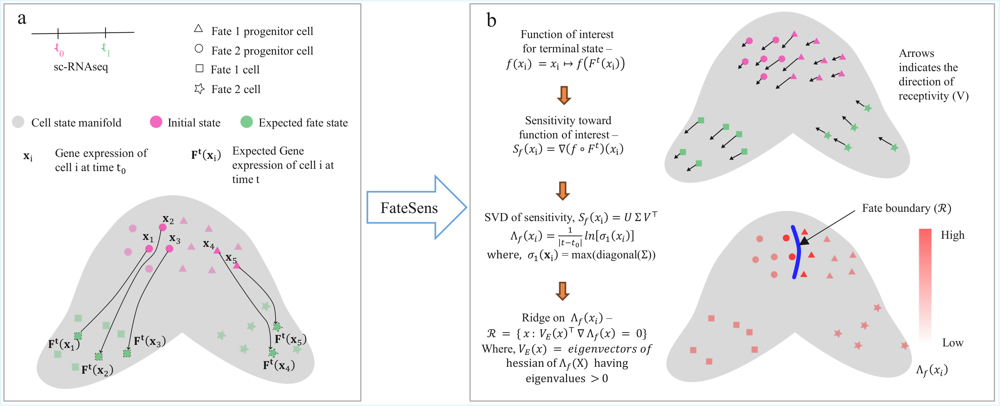

# FateSens

A sensitivity-based computational framework for analyzing gene regulatory dynamics using flow maps derived from scRNA-seq data.

## Overview



## Abstract

Cell differentiation is a dynamic process in which cells traverse through high-dimensional gene expression space under the influence of gene regulatory networks and environmental cues. Recent advances in single-cell RNA sequencing (scRNA-seq) have enabled us to measure high-resolution snapshots of this dynamic process. Several computational methods have been developed to reconstruct cellular flow maps from these snapshots, revealing the trajectories taken by cells in gene expression space. While existing methods provide increasingly detailed descriptions of cellular trajectories, the stability of these trajectories to perturbations is largely unexplored. As such, it remains unclear how robust inferred trajectories are to perturbations, which genes most strongly influence long-term fate outcomes, and where instability arises between competing fate commitments.

While sensitivity and stability analysis tools from dynamical systems theory provide a principled way to study the stability of differentiation trajectories, existing approaches are not designed for the high-dimensionality and sparsity of scRNA-seq data.

FateSens introduces a sensitivity-based computational framework for analyzing gene regulatory dynamics using flow maps derived from scRNA-seq data.

## Setup

Create a virtual environment using uv:

```bash
pip install uv
uv venv --python 3.12
source .venv/bin/activate  # On Windows: .venv\Scripts\activate
uv sync
```

## Usage

Import FateSens in your Python code:

```python
import fatesens as fs
```

## Tutorial

See the [tutorial](tutorial) folder for examples on how to use FateSens, including:
- `fate_boundary_estimation.ipynb`
- `regulatory_gene_estimation.ipynb`

## Data

The data used for this analysis can be found at (LARRY data on neutrophil-monocyte trajectory): https://doi.org/10.6084/m9.figshare.31846435

**Note:** The tutorial uses a subsampled dataset (20% of cells) for quick demonstration, which takes approximately 2-3 minutes to run. For full dataset analysis, comment out the subsampling step. Full dataset processing takes approximately 20-30 minutes on a single core.
